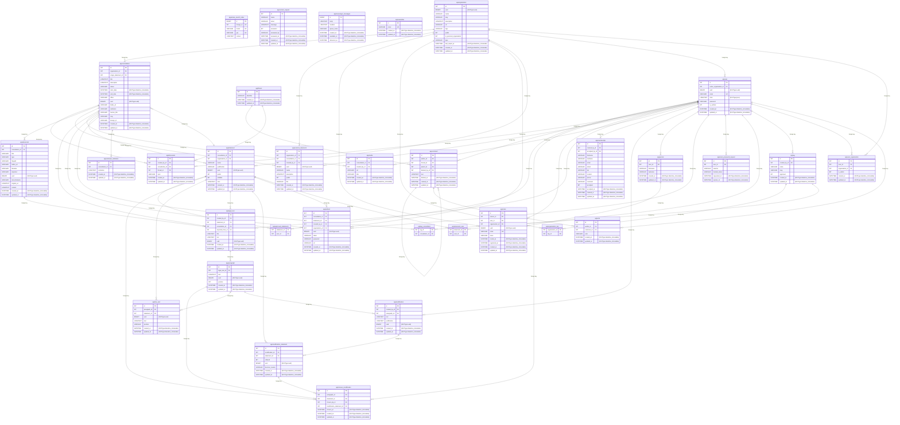

#demokratis database schema diagram

```mermaid
erDiagram

  appapproved_statements {
    INT statement_id PK
    INT user_id PK
  }

  apparaise_search_index {
    BIGINT id PK
    INT foreign_id UK
    VARCHAR model UK
    VARCHAR grp UK
    LONGTEXT content
  }

  appchosen_modification {
    INT id PK
    INT paragraph_id FK
    INT statement_id FK
    INT chosen_by_id FK
    INT modification_statement_id FK
    DATETIME chosen_at "(DC2Type:datetime_immutable)"
    DATETIME created_at "(DC2Type:datetime_immutable)"
    DATETIME updated_at "(DC2Type:datetime_immutable)"
  }

  appcomment {
    INT id PK
    INT author_id FK
    INT thread_id FK
    INT parent_id FK
    INT deleted_by_id FK
    LONGTEXT text
    DATETIME deleted_at "(DC2Type:datetime_immutable)"
    DATETIME created_at "(DC2Type:datetime_immutable)"
    DATETIME updated_at "(DC2Type:datetime_immutable)"
  }

  appconsultation {
    INT id PK
    INT organisation_id FK
    INT single_statement_id FK
    LONGTEXT title
    LONGTEXT description
    VARCHAR status
    DATETIME start_date "(DC2Type:datetime_immutable)"
    DATETIME end_date "(DC2Type:datetime_immutable)"
    VARCHAR office
    BINARY uuid "(DC2Type:uuid)"
    VARCHAR fedlex_id
    VARCHAR institution
    VARCHAR human_title
    VARCHAR slug
    VARCHAR foreign_id
    DATETIME created_at "(DC2Type:datetime_immutable)"
    DATETIME updated_at "(DC2Type:datetime_immutable)"
  }

  appcontact_request {
    INT id PK
    VARCHAR name
    VARCHAR email
    LONGTEXT message
    BIT answered
    VARCHAR answered_by
    DATETIME answered_at "(DC2Type:datetime_immutable)"
    DATETIME created_at "(DC2Type:datetime_immutable)"
    DATETIME updated_at "(DC2Type:datetime_immutable)"
  }

  appdiscussion {
    INT id PK
    INT created_by_id FK
    INT consultation_id FK
    INT thread_id FK
    VARCHAR topic
    DATETIME created_at "(DC2Type:datetime_immutable)"
    DATETIME updated_at "(DC2Type:datetime_immutable)"
  }

  appdocument {
    INT id PK
    INT consultation_id FK
    VARCHAR title
    VARCHAR type
    VARCHAR filepath
    VARCHAR fedlex_uri
    VARCHAR filename
    VARCHAR imported
    BINARY uuid "(DC2Type:uuid)"
    VARCHAR local_filename
    LONGTEXT original_uri
    LONGTEXT content
    DATETIME created_at "(DC2Type:datetime_immutable)"
    DATETIME updated_at "(DC2Type:datetime_immutable)"
  }

  appexternal_statement {
    INT id PK
    INT organisation_id FK
    INT consultation_id FK
    INT created_by_id FK
    BINARY uuid "(DC2Type:uuid)"
    VARCHAR name
    LONGTEXT description
    BIT public
    VARCHAR file
    DATETIME created_at "(DC2Type:datetime_immutable)"
    DATETIME updated_at "(DC2Type:datetime_immutable)"
  }

  appfree_text {
    INT id PK
    INT paragraph_id FK
    INT statement_id FK
    BINARY uuid "(DC2Type:uuid)"
    LONGTEXT text
    VARCHAR position
    DATETIME created_at "(DC2Type:datetime_immutable)"
    DATETIME updated_at "(DC2Type:datetime_immutable)"
  }

  appinvite {
    INT id PK
    INT person_id FK
    INT user_id FK
    INT organisation_id FK
    BINARY uuid "(DC2Type:uuid)"
    VARCHAR email UK
    VARCHAR token
    DATETIME invited_at "(DC2Type:datetime_immutable)"
    DATETIME registered_at "(DC2Type:datetime_immutable)"
    DATETIME created_at "(DC2Type:datetime_immutable)"
    DATETIME updated_at "(DC2Type:datetime_immutable)"
  }

  applegal_text {
    INT id PK
    INT created_by_id FK
    INT statement_id FK
    INT consultation_id FK
    INT imported_from_id FK
    LONGTEXT title
    LONGTEXT text
    BINARY uuid "(DC2Type:uuid)"
    DATETIME created_at "(DC2Type:datetime_immutable)"
    DATETIME updated_at "(DC2Type:datetime_immutable)"
  }

  appmedia {
    INT id PK
    INT consultation_id FK
    INT created_by_id FK
    VARCHAR url
    VARCHAR title
    DATETIME created_at "(DC2Type:datetime_immutable)"
    DATETIME updated_at "(DC2Type:datetime_immutable)"
  }

  appmembership {
    INT id PK
    INT created_by_id FK
    INT accepted_by_id FK
    VARCHAR firstname
    VARCHAR lastname
    VARCHAR email
    VARCHAR street
    VARCHAR zip
    VARCHAR location
    VARCHAR phone
    VARCHAR comment
    BIT accepted
    DATETIME accepted_at "(DC2Type:datetime_immutable)"
    DATETIME created_at "(DC2Type:datetime_immutable)"
    DATETIME updated_at "(DC2Type:datetime_immutable)"
  }

  appmessenger_messages {
    BIGINT id PK
    LONGTEXT body
    LONGTEXT headers
    VARCHAR queue_name
    DATETIME created_at "(DC2Type:datetime_immutable)"
    DATETIME available_at "(DC2Type:datetime_immutable)"
    DATETIME delivered_at "(DC2Type:datetime_immutable)"
  }

  appmodification {
    INT id PK
    INT created_by_id FK
    INT paragraph_id FK
    LONGTEXT text
    LONGTEXT justification
    BINARY uuid "(DC2Type:uuid)"
    DATETIME created_at "(DC2Type:datetime_immutable)"
    DATETIME updated_at "(DC2Type:datetime_immutable)"
  }

  appmodification_statement {
    INT id PK
    INT modification_id FK
    INT statement_id FK
    BIT refused
    BINARY uuid "(DC2Type:uuid)"
    VARCHAR decision_reason
    DATETIME created_at "(DC2Type:datetime_immutable)"
    DATETIME updated_at "(DC2Type:datetime_immutable)"
  }

  appnewsletter {
    INT id PK
    VARCHAR email UK
    DATETIME created_at "(DC2Type:datetime_immutable)"
    DATETIME updated_at "(DC2Type:datetime_immutable)"
  }

  apporganisation {
    INT id PK
    BINARY uuid "(DC2Type:uuid)"
    VARCHAR name
    VARCHAR slug
    LONGTEXT description
    VARCHAR url
    VARCHAR logo
    BIT public
    BIT is_personal_organisation
    VARCHAR type
    DATETIME last_import_at "(DC2Type:datetime_immutable)"
    DATETIME created_at "(DC2Type:datetime_immutable)"
    DATETIME updated_at "(DC2Type:datetime_immutable)"
  }

  apporganisation_tag {
    INT organisation_id PK
    INT tag_id PK
  }

  appparagraph {
    INT id PK
    INT legal_text_id FK
    LONGTEXT text
    BINARY uuid "(DC2Type:uuid)"
    INT position
    DATETIME created_at "(DC2Type:datetime_immutable)"
    DATETIME updated_at "(DC2Type:datetime_immutable)"
  }

  appperson {
    INT id PK
    INT user_id FK
    VARCHAR firstname
    VARCHAR lastname
    DATETIME created_at "(DC2Type:datetime_immutable)"
    DATETIME updated_at "(DC2Type:datetime_immutable)"
  }

  appredirect {
    INT id PK
    INT consultation_id FK
    INT statement_id FK
    INT created_by_id FK
    INT organisation_id FK
    BINARY uuid "(DC2Type:uuid)"
    VARCHAR token
    VARCHAR password
    VARCHAR url
    DATETIME created_at "(DC2Type:datetime_immutable)"
    DATETIME updated_at "(DC2Type:datetime_immutable)"
  }

  appreset_password_request {
    INT id PK
    INT user_id FK
    VARCHAR selector
    VARCHAR hashed_token
    DATETIME requested_at "(DC2Type:datetime_immutable)"
    DATETIME expires_at "(DC2Type:datetime_immutable)"
  }

  appstatement {
    INT id PK
    INT consultation_id FK
    INT organisation_id FK
    VARCHAR name
    VARCHAR justification
    BINARY uuid "(DC2Type:uuid)"
    BIT public
    BIT editable
    LONGTEXT intro
    DATETIME created_at "(DC2Type:datetime_immutable)"
    DATETIME updated_at "(DC2Type:datetime_immutable)"
  }

  appstatement_user {
    INT statement_id PK
    INT user_id PK
  }

  apptag {
    INT id PK
    INT created_by_id FK
    VARCHAR name
    VARCHAR slug
    BIT approved
    DATETIME created_at "(DC2Type:datetime_immutable)"
    DATETIME updated_at "(DC2Type:datetime_immutable)"
  }

  apptag_consultation {
    INT tag_id PK
    INT consultation_id PK
  }

  appthread {
    INT id PK
    VARCHAR identifier
    DATETIME created_at "(DC2Type:datetime_immutable)"
    DATETIME updated_at "(DC2Type:datetime_immutable)"
  }

  appunknown_institution {
    INT id PK
    INT consultation_id FK
    LONGTEXT institution
    DATETIME created_at "(DC2Type:datetime_immutable)"
    DATETIME updated_at "(DC2Type:datetime_immutable)"
  }

  appuser {
    INT id PK
    INT active_organisation_id FK
    BINARY uuid "(DC2Type:uuid)"
    VARCHAR email UK
    LONGTEXT roles "(DC2Type:json)"
    VARCHAR password
    BIT is_verified
    DATETIME created_at "(DC2Type:datetime_immutable)"
    DATETIME updated_at "(DC2Type:datetime_immutable)"
  }

  appuser_organisation {
    INT id PK
    INT user_id FK
    INT organisation_id FK
    BIT is_admin
    DATETIME created_at "(DC2Type:datetime_immutable)"
    DATETIME updated_at "(DC2Type:datetime_immutable)"
  }

  appvote {
    INT id PK
    INT author_id FK
    INT comment_id FK
    VARCHAR vote
    DATETIME created_at "(DC2Type:datetime_immutable)"
    DATETIME updated_at "(DC2Type:datetime_immutable)"
  }

  appcomment ||--o{ appcomment : "foreign key"
  appcomment ||--o{ appvote : "foreign key"
  appconsultation ||--o{ appdiscussion : "foreign key"
  appconsultation ||--o{ appdocument : "foreign key"
  appconsultation ||--o{ appexternal_statement : "foreign key"
  appconsultation ||--o{ applegal_text : "foreign key"
  appconsultation ||--o{ appmedia : "foreign key"
  appconsultation ||--o{ appredirect : "foreign key"
  appconsultation ||--o{ appstatement : "foreign key"
  appconsultation ||--o{ apptag_consultation : "foreign key"
  appconsultation ||--o{ appunknown_institution : "foreign key"
  appdocument ||--o{ applegal_text : "foreign key"
  applegal_text ||--o{ appparagraph : "foreign key"
  appmodification ||--o{ appmodification_statement : "foreign key"
  appmodification_statement ||--o{ appchosen_modification : "foreign key"
  apporganisation ||--o{ appconsultation : "foreign key"
  apporganisation ||--o{ appexternal_statement : "foreign key"
  apporganisation ||--o{ appinvite : "foreign key"
  apporganisation ||--o{ apporganisation_tag : "foreign key"
  apporganisation ||--o{ appredirect : "foreign key"
  apporganisation ||--o{ appstatement : "foreign key"
  apporganisation ||--o{ appuser : "foreign key"
  apporganisation ||--o{ appuser_organisation : "foreign key"
  appparagraph ||--o{ appchosen_modification : "foreign key"
  appparagraph ||--o{ appfree_text : "foreign key"
  appparagraph ||--o{ appmodification : "foreign key"
  appperson ||--o{ appinvite : "foreign key"
  appstatement ||--o{ appapproved_statements : "foreign key"
  appstatement ||--o{ appchosen_modification : "foreign key"
  appstatement ||--o{ appconsultation : "foreign key"
  appstatement ||--o{ appfree_text : "foreign key"
  appstatement ||--o{ applegal_text : "foreign key"
  appstatement ||--o{ appmodification_statement : "foreign key"
  appstatement ||--o{ appredirect : "foreign key"
  appstatement ||--o{ appstatement_user : "foreign key"
  apptag ||--o{ apporganisation_tag : "foreign key"
  apptag ||--o{ apptag_consultation : "foreign key"
  appthread ||--o{ appcomment : "foreign key"
  appthread ||--o{ appdiscussion : "foreign key"
  appuser ||--o{ appapproved_statements : "foreign key"
  appuser ||--o{ appchosen_modification : "foreign key"
  appuser ||--o{ appcomment : "foreign key"
  appuser ||--o{ appdiscussion : "foreign key"
  appuser ||--o{ appexternal_statement : "foreign key"
  appuser ||--o{ appinvite : "foreign key"
  appuser ||--o{ applegal_text : "foreign key"
  appuser ||--o{ appmedia : "foreign key"
  appuser ||--o{ appmembership : "foreign key"
  appuser ||--o{ appmodification : "foreign key"
  appuser ||--o{ appperson : "foreign key"
  appuser ||--o{ appredirect : "foreign key"
  appuser ||--o{ appreset_password_request : "foreign key"
  appuser ||--o{ appstatement_user : "foreign key"
  appuser ||--o{ apptag : "foreign key"
  appuser ||--o{ appuser_organisation : "foreign key"
  appuser ||--o{ appvote : "foreign key"
```
